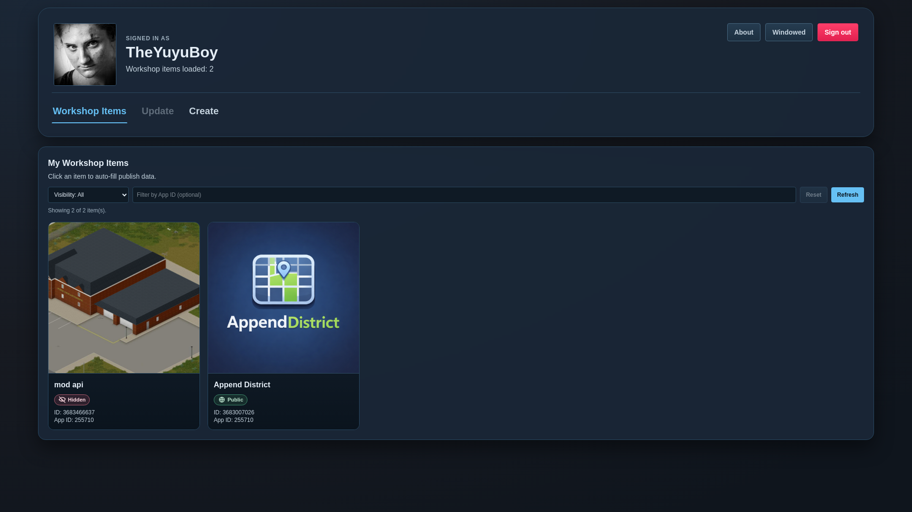
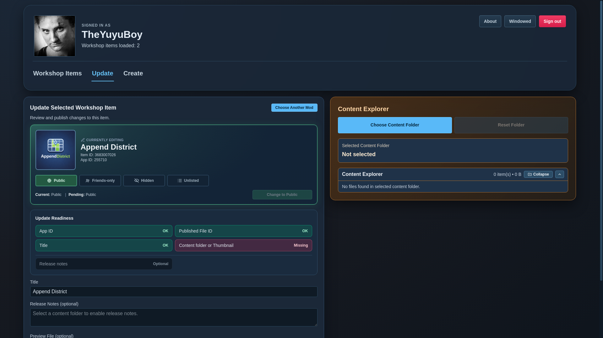

# Workshop Manager

Workshop Manager is a desktop app for creating, updating, and maintaining Steam Workshop items. It is built with Electron, Vue 3, TypeScript, and Tailwind, and wraps the SteamCMD workflow in a more guided UI for Linux and Windows users.

> [!NOTE]
> `pnpm dev`, `pnpm preview`, `pnpm test`, and `pnpm typecheck` run natively on the host.
> All `pnpm build*` and `pnpm release` packaging commands run through Docker.

## Screenshots

| Screenshot 1 | Screenshot 2 |
| --- | --- |
|  |  |

## What It Does

- Signs in to Steam, including Steam Guard flows
- Installs or detects SteamCMD automatically, with a manual fallback path
- Creates new Workshop items
- Updates existing Workshop items
- Changes Workshop item visibility
- Persists profiles, settings, and run logs locally
- Keeps the Electron boundary locked down with `nodeIntegration: false`, `contextIsolation: true`, and a preload bridge

> [!IMPORTANT]
> Authentication supports Steam Guard mobile approvals and OTP/email-code prompts.
> The login UI auto-detects the challenge Steam requests and adapts accordingly.

## Requirements

| Use case | Requirement |
| --- | --- |
| Development | Node.js `22.x` |
| Development | `pnpm` `10.x` |
| Packaging builds | Docker on a Linux or Windows host |


Packaging commands always run inside the repo's Docker builder image, even when launched from Windows.

> [!TIP]
> Use `pnpm dev:icon` or `pnpm preview:icon` only when you want to regenerate icon assets first.

## Getting Started

| Step | Command | Notes |
| --- | --- | --- |
| Install dependencies | `pnpm install` | Required once after cloning |
| Start development mode | `pnpm dev` | Fast local dev path on Linux and Windows |
| Start development mode with icon sync | `pnpm dev:icon` | Regenerates icon assets first |
| Run tests | `pnpm test` | Runs Vitest |
| Run type checks | `pnpm typecheck` | Checks Node, renderer, and test TS configs |
| Preview production renderer | `pnpm preview` | Local preview path on Linux and Windows |
| Preview with icon sync | `pnpm preview:icon` | Regenerates icon assets first |

> [!NOTE]
> On Windows, the native `Choose Content Folder` dialog is a directory picker, not a normal file browser. It may not show the files inside a folder while you are navigating, but the app will still scan the selected folder and show its files afterward in the in-app Content Explorer.

## Build And Package

| Goal | Command | Output / Notes |
| --- | --- | --- |
| Build production bundle only | `pnpm build` | Writes compiled app output to `out/` |
| Build Linux package | `pnpm build:linux` | Produces Linux `.AppImage` artifacts |
| Build Linux package with icon sync | `pnpm build:linux:icon` | Regenerates icon assets first |
| Build Windows package | `pnpm build:win` | Produces Windows installer artifacts |
| Build Windows package with icon sync | `pnpm build:win:icon` | Regenerates icon assets first |
| Build Linux and Windows with icon sync | `pnpm build:all:icon` | Runs both platform packaging commands |
| Write checksums for existing release artifacts | `pnpm release:checksums` | Scans `dist/` and writes one `.checksum.txt` file per artifact |
| Release bundle with checksums | `pnpm release` | Builds Linux and Windows artifacts with icon sync, then writes per-artifact checksum files |

> [!IMPORTANT]
> Docker is build-only. The generated `.AppImage` and `.exe` run natively after packaging.
> Dockerized builds are currently supported on Linux and Windows hosts.

Packaging commands always rebuild the app bundle first so installers do not ship stale `out/` code.
The wrapper performs host-side cleanup before entering Docker so stale local Electron processes do not interfere with packaging.
Persistent Docker build caches live under `~/.cache/workshop-manager/docker-build`.
Output artifacts are written to `dist/`.


> Packaging command suffixes are composable: `:icon` regenerates icon assets first, and `:checksums` runs the package command and then writes per-artifact checksum files. The generic pattern is `pnpm build:<platform>:checksums`, and icon-aware variants follow `pnpm build:<platform>:icon:checksums`. For example, `pnpm build:win:checksums` packages Windows artifacts and writes checksums, while `pnpm build:linux:icon:checksums` also refreshes icon assets first.

## Verifying Release Downloads

Each public release artifact is accompanied by its own checksum file in `dist/`:

- `Workshop Manager-<version>-linux-x86_64.AppImage.checksum.txt`
- `Workshop Manager-<version>-win-x64.exe.checksum.txt`

Each checksum file contains the SHA-256 hash for its matching artifact. Upload the app files and their `.checksum.txt` companions together on GitHub Releases.

You can generate those checksum files in two ways:

- `pnpm release` to build fresh Linux and Windows artifacts and then write checksums
- `pnpm release:checksums` to only write checksum files for artifacts that already exist in `dist/`

On Linux, users can verify a download with:

```bash
sha256sum -c "Workshop Manager-<version>-linux-x86_64.AppImage.checksum.txt"
```

On Windows PowerShell, users can compare the file hash with:

```powershell
Get-FileHash ".\Workshop Manager-<version>-win-x64.exe" -Algorithm SHA256
Get-Content ".\Workshop Manager-<version>-win-x64.exe.checksum.txt"
```

For this portfolio project, the checksum pipeline is the intended release-integrity mechanism. Native Windows code signing is optional and not required for the published demo builds.

## Changing The App Icon

`resources/img/app-icon.png` is the single source of truth for the app icon used by both the app and packaged builds.

> [!NOTE]
> `pnpm sync:icon` is the manual icon-only step. The `:icon` build and preview commands simply run that sync step first, then continue with the main command.

## Project Layout

| Path | Purpose |
| --- | --- |
| `src/electron` | Electron main process and preload bridge |
| `src/backend` | SteamCMD services, persistence stores, and Workshop-related backend logic |
| `src/shared` | IPC contracts and shared domain types |
| `src/frontend` | Vue renderer application |
| `scripts` | Local tooling for cleanup, icon sync, packaging, and Docker build orchestration |
| `docker` | Docker image used for reproducible packaging builds |
| `test` | Unit and integration tests |

## Data And Security Notes

| Item | Behavior |
| --- | --- |
| Username/session preferences | Can be persisted when enabled |
| Passwords | Not stored as plain local config values |
| Steam Web API keys | Stored through Electron secure storage when available |
| Run logs | Stored locally so failed SteamCMD runs can be inspected later |
