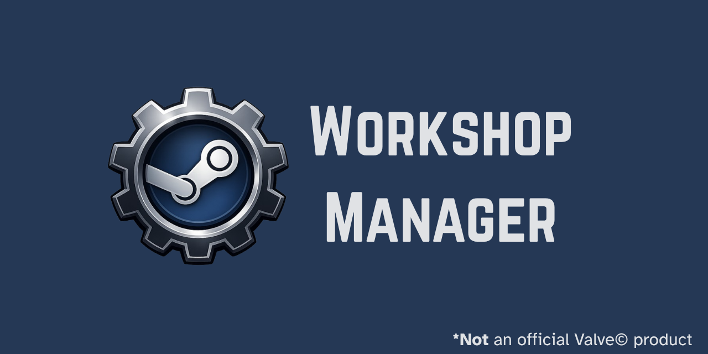
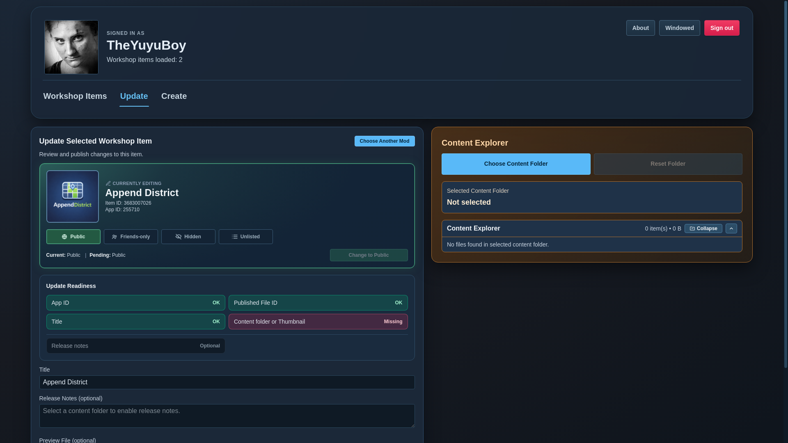

[](https://github.com/YounesRabeh/workshop-manager)

<div align="center">

  <p align="center">
    
    <a href="LICENSE"></a>
  </p>

  <p align="center">
    <a href="https://github.com/YounesRabeh/workshop-manager/releases/latest"></a>
    <a href="docs/README.md"></a>
  </p>

  <p align="center">
    <a href="#features">Features</a> •
    <a href="#screenshots">Screenshots</a> •
    <a href="#quick-start">Quick Start</a> •
    <a href="#tech-stack">Tech Stack</a>
  </p>

  <p>
    A desktop app for creating, updating, and maintaining Steam Workshop items
  </p>
</div>

---

## Features

- 🔐 Sign in using your Steam account with email codes, OTP, or Steam Mobile approval.
- 🚀 Create Workshop items and update their content, preview image, metadata, or visibility.
- 🗂️ Reuse profiles and optionally load published items through the Steam Web API.
- 🛠️ Inspect local run logs and manage SteamCMD without exposing Node.js to the renderer.

## Tech stack

<p align="left"><a href="https://www.electronjs.org/"></a> <a href="https://vuejs.org/"></a> <a href="https://www.typescriptlang.org/"></a> <a href="https://tailwindcss.com/"></a> <a href="https://nodejs.org/"></a> <a href="https://pnpm.io/"></a> <a href="https://www.docker.com/"></a></p>

## Screenshots

| Publish workflow | Workshop item management |
| --- | --- |
|  |  |

## Quick start

Requires [Node.js 22 or 24](https://nodejs.org/) and [pnpm 11](https://pnpm.io/).

```bash
git clone https://github.com/YounesRabeh/workshop-manager.git
cd workshop-manager
pnpm install
pnpm dev
```

| Need | Command |
| --- | --- |
| Run tests | `pnpm test` |
| Check types | `pnpm typecheck` |
| Build the app | `pnpm build` |
| Package a release | `pnpm release` |

Packaging runs in Docker and writes artifacts to `dist/`. See [build and release instructions](docs/builds-and-releases.md).

## Documentation

The [documentation hub](docs/README.md) organizes every guide by task:

| I want to… | Start here |
| --- | --- |
| Use the app | [Authentication](docs/authentication.md) · [Workshop management](docs/workshop-management.md) · [Profiles and settings](docs/profiles-and-settings.md) |
| Diagnose a problem | [Logging and troubleshooting](docs/logging-and-troubleshooting.md) · [SteamCMD runtime](docs/steamcmd-runtime.md) |
| Develop or release it | [Architecture](docs/architecture.md) · [Development and testing](docs/development-and-testing.md) · [Builds and releases](docs/builds-and-releases.md) · [Security](docs/security.md) |

---

## License

Distributed under the [MIT License](LICENSE).
