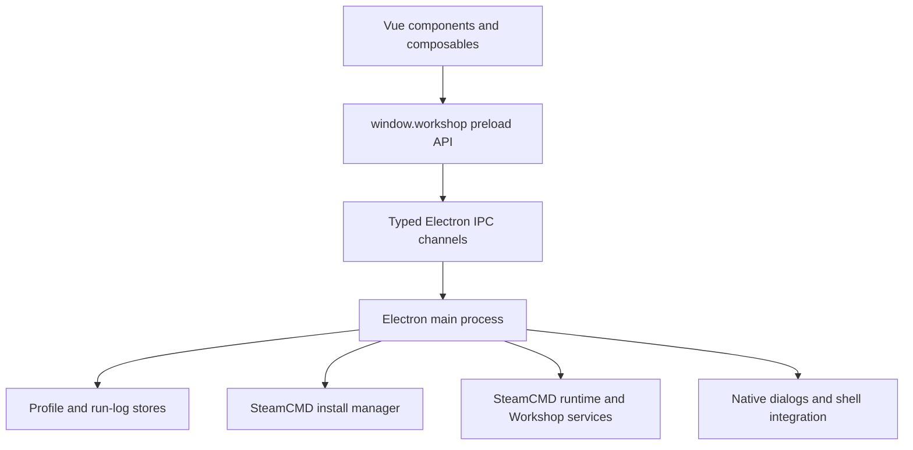

# Architecture

[Documentation index](README.md) · [Project README](../README.md)

Workshop Manager is an Electron application with a Vue renderer and a Node backend hosted by the Electron main process. Shared contracts keep IPC payloads and domain models consistent across those boundaries.

## Runtime flow

The renderer does not receive Node.js access. `BrowserWindow` uses `nodeIntegration: false`, `contextIsolation: true`, and `sandbox: true`. The preload exposes only the methods declared by `WorkshopApi`.

## Code ownership

| Path | Responsibility |
| --- | --- |
| `src/frontend` | Vue UI, view state, composables, validation feedback, and run-event presentation |
| `src/electron` | Application lifecycle, window policy, IPC handlers, secure storage, dialogs, and user-data migration |
| `src/backend/services` | SteamCMD installation/execution, output parsing, Workshop commands, identity resolution, and remote item loading |
| `src/backend/stores` | Profile/settings JSON and current-session run logs |
| `src/shared` | IPC names, payload/result types, timeout rules, and Workshop requirement evaluators |
| `src/main`, `src/preload`, `src/renderer` | Electron Vite entry points |
| `scripts` | Development, testing, packaging, checksums, and cleanup tooling |

## Main application startup

`src/electron/main.ts` performs the application setup:

1. Select the stable `workshop-manager` user-data directory and migrate missing legacy files.
2. Create the profile store, run-log store, install manager, and SteamCMD runtime.
3. Purge stale ephemeral SteamCMD scripts.
4. Apply persisted timeout and authentication settings.
5. Register IPC handlers and forward runtime events to the renderer.
6. Create the sandboxed browser window.

## Adding a capability

Keep a change within the narrowest layer possible:

1. Define cross-boundary data in `src/shared/contracts.ts` and the channel in `src/shared/ipc.ts`.
2. Add the backend behavior under `src/backend`.
3. Register and validate the IPC operation in `src/electron/main.ts`.
4. Expose only the required preload method in `src/electron/preload.ts`.
5. Keep renderer orchestration in a composable and presentation in a component.
6. Add unit tests for each layer and an integration test when process or filesystem behavior crosses layers.

Related pages: [Authentication](authentication.md), [SteamCMD runtime](steamcmd-runtime.md), and [Workshop management](workshop-management.md).
